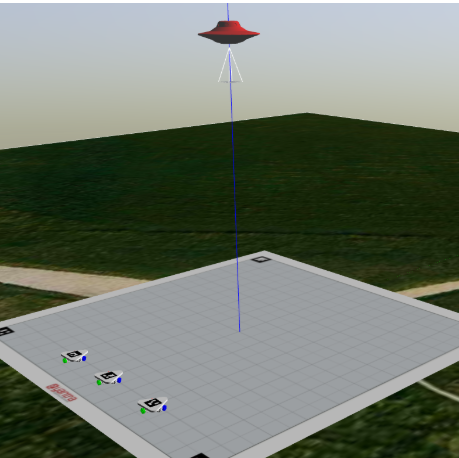
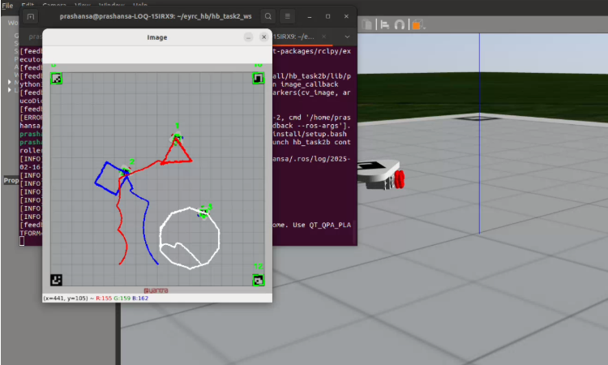

# Swarm Bots Simulation Phase

  

A ROS 2-based simulation of swarm robotics using three omni-wheel robots coordinated through ArUco marker detection. This phase of the project focuses on software simulation, localization, and synchronized movement using PID controllers.

---

## Aim

To simulate three swarm bots in the ROS-based environment and generate a controller for ArucoMarker detection by camera.
---

## Introduction

Swarm robotics focuses on the coordinated movement of multiple robots to achieve collective tasks efficiently. This project involves the software simulation of a three-robot swarm in a ROS-based environment, using ArUco markers (IDs 1, 2, and 3) for localization and coordination. The robots are simulated in Gazebo and controlled using PID (Proportional-Integral-Derivative) controllers to ensure smooth and synchronized movement while avoiding collisions. The PID control system helps to maintain stability and accuracy in trajectory tracking. This phase aims to test and refine swarm behavior strategies in a virtual environment before transitioning to real-world applications.

## Key Features

- Simulates a 3-robot swarm in Gazebo
- Uses ArUco markers (IDs 1, 2, and 3) for localization
- Real-time robot control with PID controllers
- Camera-based detection using OpenCV
- Modular architecture using ROS2 nodes and topics

---

## Tech Stack

### OS & Development
- Ubuntu 22.04
- ROS 2 Humble
- Gazebo
- VS Code

### Programming
- Python (ROS2 Nodes, PID, computer vision)

### Simulation & Control
- Gazebo (for 3D simulation)
- URDF (robot modeling)
- PID Controller (Python)

### Computer Vision
- OpenCV (cv2)
- ArUco Marker Detection

---

## Project Flow

### 🔹 Task 4a
- Single robot manual control in Gazebo using keyboard.
- Controller handles chassis velocities directly (not individual wheels).

### 🔹 Task 4b
- Two-node system: `service_node.py` (generates poses) and `controller_node.py` (executes movement).
- Uses launch files for running both nodes simultaneously.
- Robot moves autonomously using PID on pose error.

### 🔹 Task 5a
- Adds ArUco marker and virtual camera for realistic localization.
- Introduces omni-wheel dynamics by controlling individual wheel velocities.
- Uses:
  - `feedback.py` – subscribes to `/camera/image_raw`, publishes pose to `/detected_aruco`
  - `controller.py` – subscribes to `/detected_aruco`, publishes wheel velocities after PID and matrix transformation

### 🔹 Task 5b
- Expands Task 5a to three robots with independent controller nodes.
- Fully simulated swarm behavior with localization and synchronization.

  

---

## Setup & Running: 

### Prerequisites
- ROS 2 Humble installed
- Gazebo installed and configured
- Python3 & OpenCV installed
